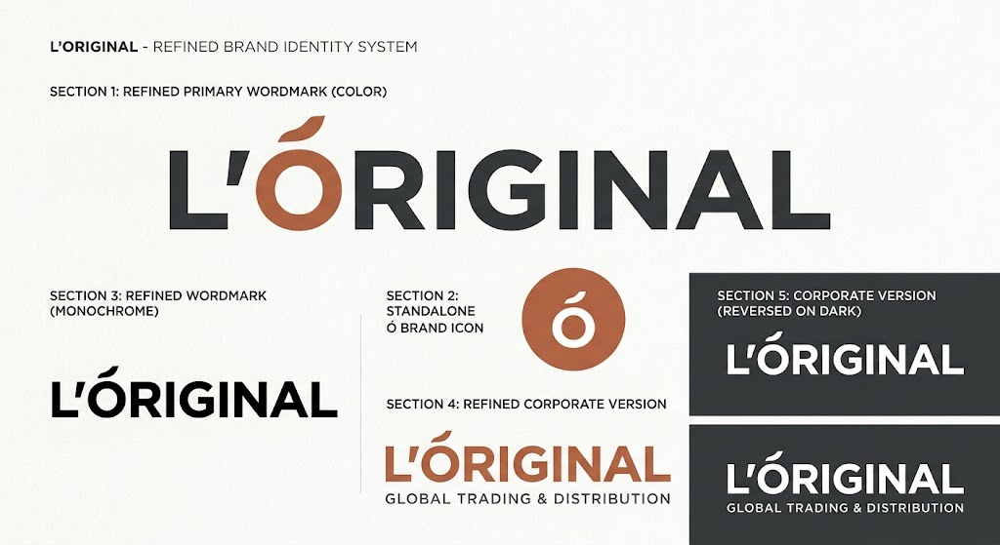

# L’ORIGINAL — Global Trading & Distribution

  

 

  <strong>Bridging Global Manufacturers and African Growth Markets</strong>

  <a href="#about-the-brand">About</a> •
  <a href="#core-value-proposition">Value Proposition</a> •
  <a href="#target-markets">Markets</a> •
  <a href="#business-architecture">Architecture</a> •
  <a href="#brand-identity">Brand Identity</a> •
  <a href="#roadmap">Roadmap</a>

---

## 📌 About The Brand

**L’ORIGINAL** is a modern international trading, sourcing, and distribution enterprise. The company specializes in sourcing carefully selected, verified goods from Europe and global manufacturing hubs, then distributing them across high-growth African markets.

By placing **guaranteed authenticity** at the center of its identity, L’ORIGINAL eliminates trade friction, counterfeit risks, and supply chain fragmentation for regional businesses.

---

## 🚀 Core Value Proposition

In markets flooded with unverified intermediaries and sub-par imports, L’ORIGINAL delivers:

* **Verified Authenticity:** Guaranteed original products sourced directly from vetted international manufacturers.
* **Streamlined Supply Chain:** Complete management of international freight, customs clearance, and logistics pipelines.
* **Risk Reduction:** Protection against counterfeit products, scam suppliers, and sub-standard production runs.
* **Commercial Access:** Local access and structured procurement terms for regional wholesalers and enterprise buyers.

---

## 🌐 Target Markets & Operations

### Origin Markets
* **Europe:** Primary sourcing hub for premium quality, technical, and consumer goods.
* **Global Hubs (China/Asia):** Strategic direct-from-factory sourcing for high-volume, high-demand commercial categories.

### Destination Markets
* **Phase 1:** North Africa (Maghreb Region).
* **Phase 2:** Key commercial hubs across West & Central Africa.

---

## 🏗️ Business Architecture

[ Global Suppliers / EU / Asia ]
              │
              ▼
[ L’ORIGINAL Sourcing & Verification ]
              │
              ▼
[ Freight & Logistics Pipeline ]
              │
              ▼
[ Regional Distribution & B2B Wholesale ]

### Strategic Focus Areas
1. **B2B Wholesale (Primary):** Bulk importing and supply contracts for local distributors, retail chains, and commercial enterprises.
2. **Direct-to-Business / B2C (Secondary):** Selective distribution of specialized, high-margin product verticals.

---

## 🎨 Brand Identity

* **Primary Mark:** Custom wordmark featuring the integrated signature **Ó**.
* **Visual Direction:** Minimalist, bold, and contemporary sans-serif typography.
* **Color Palette:** 
  * Deep Charcoal / Black (`#1A1A1A`)
  * Warm Off-White (`#F9F9F8`)
  * Terracotta / Copper Accent (`#B85233`)

---

## 🗓️ Strategic Roadmap

- [x] **Phase 1: Brand Foundation**
  - [x] Visual Brand Identity & Logo System
  - [x] Brand Positioning & Architecture
- [ ] **Phase 2: Operational Infrastructure**
  - [ ] Legal Entity & Trademark Registration
  - [ ] Freight Route & Logistics Partner Mapping
  - [ ] Initial Sourcing Category Definition
- [ ] **Phase 3: Market Launch**
  - [ ] Pilot Product Procurement
  - [ ] B2B Onboarding & Regional Distribution Contracts

---

## 📬 Contact & Inquiries

For partnership, sourcing, or distribution inquiries:

* **Website:** loriginal-dz.com loriginal.com *(Upcoming)*
* **Email:** Upcoming
* **Corporate HQ:** Europe / Africa Trading Desk

---

  © 2026 L’ORIGINAL Global Trading & Distribution. All rights reserved.

